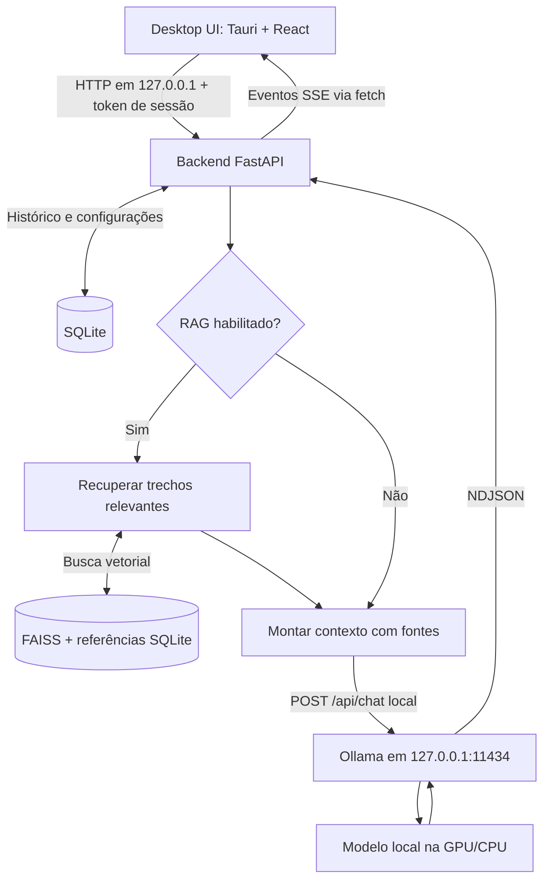

# Fase 1 — arquitetura

## Escopo e decisões

O objetivo final é um tutor pessoal com chat, histórico pesquisável, materiais, RAG, cursos, laboratórios e memória controlável. A primeira entrega executável será apenas a interface desktop na Fase 2. Não implementaremos todos os módulos antecipadamente.

Adotaremos um monólito modular: um backend com módulos pequenos e responsabilidades separadas, em vez de vários serviços. Isso facilita estudar, testar e distribuir um aplicativo de um usuário.

| Componente | Escolha | Motivo e custo |
|---|---|---|
| Janela desktop | Tauri 2 | Usa WebView2 do Windows; evita distribuir um Chromium inteiro. Exige Rust e ferramentas C++ para compilar. |
| Interface | React + TypeScript + Vite | Componentes reutilizáveis, tipos para contratos e desenvolvimento rápido. Exige toolchain Node durante desenvolvimento. |
| Backend | Python + FastAPI + Uvicorn | Ecossistema de documentos/IA, validação e API explícita. Exige administrar um processo adicional. |
| Inferência | Ollama local | Troca de modelos via API e execução na GPU. Será dependência separada do instalador inicialmente. |
| Histórico | SQLite | Banco transacional em arquivo, sem servidor de banco separado. |
| Busca vetorial | FAISS CPU + metadados SQLite | Biblioteca local de similaridade. FAISS não é um banco completo: persistência, associação a documentos e consistência ficam sob nossa responsabilidade. |
| Markdown | react-markdown + remark-gfm + realce de sintaxe | Texto, tabelas e código; conteúdo gerado deve ser tratado como não confiável. |

Electron é uma alternativa válida, com Chromium/Node integrados e menos trabalho em Rust, mas traz um runtime maior. Para preservar recursos para o modelo, a escolha inicial é Tauri. O consumo real será medido; Tauri não torna o backend Python ou o modelo menores.

ChromaDB oferece coleções e metadados prontos, mas acrescenta comportamento e configuração que precisaríamos auditar, inclusive downloads implícitos e telemetria. FAISS atende à base pessoal inicial com uma arquitetura explícita. A interface `VectorStore` permitirá reconsiderar essa escolha sem alterar a interface gráfica.

## Fluxo principal



O RAG acontece antes da geração. Ele pode chamar o Ollama para calcular o embedding da pergunta; não é outro modelo de chat e não precisa executar quando a base estiver vazia.

1. Usuário envia pergunta com Ctrl+Enter; Enter insere nova linha.
2. Backend valida modo, modelo instalado, limites e estado do chat.
3. A partir da Fase 5, grava a pergunta e cria uma resposta com estado `generating`.
4. Monta contexto com instruções didáticas, memória habilitada, histórico recente e trechos pertinentes.
5. Solicita geração ao Ollama; converte fragmentos NDJSON em eventos para a interface.
6. A interface mostra texto progressivamente. Ao concluir, grava resposta, fontes e métricas reais.
7. Cancelamento interrompe a requisição ao Ollama e marca a mensagem como incompleta. Falhas preservam texto parcial sem apresentá-lo como resposta concluída.

## Estrutura planejada

Estas pastas serão criadas somente na fase correspondente. A raiz atual do repositório já representa `cyber-ai/`; não criaremos outra raiz aninhada.

```text
cyber-ai/
  desktop/                 # Tauri: janela, permissões, ciclo de vida
  frontend/
    src/
      components/          # Elementos visuais reutilizáveis
      features/            # Chat, configurações, materiais, cursos
      services/            # Cliente tipado da API
  backend/
    app/
      main.py              # Composição e inicialização; sem regras de negócio
      api/                 # Rotas, validação, tradução de erros
      domain/              # Entidades e contratos independentes de framework
      services/            # Casos de uso: enviar pergunta, importar material
      infrastructure/      # Clientes Ollama, SQLite, arquivos, hardware
      knowledge/           # Extração e fragmentação de documentos
      rag/                 # Indexação, recuperação e composição de fontes
      courses/             # Cursos, avaliações e progresso
      labs/                # Roteiros; sem execução de comandos
      memory/              # Preferências de aprendizagem consentidas
    migrations/            # Evolução versionada do esquema SQLite
  config/                  # Defaults públicos e prompts versionados
  docs/                    # Arquitetura, instalação, decisões, guias
  tests/                   # Unidade, integração e ponta a ponta
```

Os pesos serão administrados pelo Ollama, não pelo Git. Dados mutáveis ficarão em `%LOCALAPPDATA%/CyberAITutor/`: `database/app.sqlite3`, `knowledge/`, `rag/`, `logs/app.log` e backups locais. O diretório do programa pode ser somente leitura após instalação.

As rotas chamam serviços; serviços dependem de contratos como `ChatRepository`, `ModelClient` e `VectorStore`. Implementações concretas ficam em infraestrutura. React nunca acessa o SQLite diretamente.

## Processo desktop e API

Em desenvolvimento, frontend e backend poderão ser iniciados separadamente. Na distribuição, o processo Tauri iniciará um executável Python auxiliar (sidecar), aguardará sua saúde e o encerrará ao fechar a aplicação. Só encerrará processos que ele próprio iniciou. Ollama externo já aberto não será encerrado.

O backend fará bind exclusivamente em `127.0.0.1`, usando porta disponível comunicada ao Tauri por canal privado de inicialização. Uma porta fixa poderá ser usada em desenvolvimento. Um token aleatório por execução será transmitido ao backend por stdin e à UI por comando Tauri restrito, sem colocá-lo em logs ou argumentos de linha de comando. A UI enviará `Authorization: Bearer ...`.

Contratos planejados, prefixados por `/api/v1`:

| Recurso | Operações e finalidade |
|---|---|
| `/health` | GET: prontidão do backend; estado do Ollama separado |
| `/hardware` | GET: CPU, RAM, GPU, VRAM e valores desconhecidos explícitos |
| `/models` | GET: modelos locais via Ollama `/api/tags`; nunca baixar ao listar |
| `/chats` | POST/GET: criar e pesquisar chats, com paginação |
| `/chats/{id}/messages` | GET/POST: histórico e envio; IDs de requisição para evitar duplicação |
| `/generations/{id}/cancel` | POST: cancelar geração ativa |
| `/documents` | POST/GET/DELETE: importar, consultar estado e excluir material |
| `/settings` | GET/PATCH: modelo, contexto, tema, RAG, memória |
| `/memories` | GET/POST/DELETE: consultar, confirmar e apagar memórias |
| `/courses`, `/progress`, `/labs` | Contratos detalhados apenas nas Fases 9 e 10 |

POST de mensagem produzirá stream SSE com eventos `start`, `delta`, `sources`, `done` e `error`. Usaremos `fetch` com leitor de stream, pois o `EventSource` nativo não resolve POST com cabeçalho de autenticação. Erros antes do stream usam status HTTP; depois de aberto, usam evento `error` com código, explicação e identificador de diagnóstico. Não reenviar automaticamente uma geração após falha.

Uma geração ativa por vez será o padrão. Cancelamento, timeouts de conexão e de geração terão tratamento diferente. Falta do Ollama não deve impedir abrir histórico ou configurações.

## Dados e consistência

| Tabela | Campos essenciais planejados |
|---|---|
| users | id, display_name, created_at; um usuário inicial |
| chats | id, user_id, title, category, created_at, updated_at |
| messages | id, chat_id, role, content, mode, model, status, request_id, created_at |
| documents | id, user_id, name, managed_path, hash, media_type, status, error_code |
| chunks | id, document_id, ordinal, text, page, source_location, embedding_version |
| message_sources | message_id, chunk_id, excerpt_snapshot, score |
| memories | id, user_id, text, enabled, provenance, confirmed_at |
| settings | user_id, key, value_json, schema_version |
| courses/modules/lessons | estrutura ordenada e conteúdo versionado |
| labs/quizzes/progress | roteiro, perguntas, tentativas e conclusão por usuário |

SQLite usará chaves estrangeiras, consultas parametrizadas, transações e migrações. Busca textual com FTS5 será validada no runtime distribuído. WAL ajuda leitura simultânea, mas não remove a necessidade de controlar escrita. Backup usará a API de backup SQLite; não copiar apenas o arquivo principal enquanto há escrita.

FAISS será índice derivado, reconstruível a partir de chunks e embeddings locais. Começaremos com vetores normalizados e similaridade por produto interno, equivalente ao cosseno. Índice e manifesto terão geração/versionamento, gravação temporária e troca atômica. Exclusões primeiro tornam documentos indisponíveis no SQLite; filtros impedem recuperar trechos excluídos mesmo antes de reconstruir o índice. Falha de indexação fica visível como `failed`, permitindo nova tentativa.

## Materiais e RAG

Importação: selecionar arquivo → validar extensão/tamanho → copiar para área gerenciada → calcular hash → extrair texto → guardar metadados. PDF inicialmente precisa ter camada textual; PDF digitalizado recebe aviso de OCR ainda não disponível. Código é lido como texto e nunca importado ou executado.

Indexação: texto → chunks com localização → embeddings locais → índice FAISS + referências SQLite. Começar com aproximadamente 400–700 tokens por trecho, pequena sobreposição e ajuste por medição. Preservar blocos de código quando possível; impor limites por arquivo e por lote.

Embedding é uma representação numérica de significado. O modelo de embeddings é separado do modelo de conversa; candidato inicial: `embeddinggemma`, sujeito a medição e download informado na Fase 8. Documento e pergunta usam exatamente o mesmo modelo, versão, dimensão e normalização. Trocar o embedding exige reindexar; trocar somente o modelo de chat não.

Consulta: embedding da pergunta → melhores trechos (começar com top-k=4) → filtro de relevância calibrado → inclusão no contexto com IDs de fonte. A resposta exibirá documento/página/trecho; referências inexistentes serão rejeitadas pela aplicação. Sem correspondência suficiente, o tutor informa que respondeu com conhecimento geral. Similaridade não é probabilidade de verdade.

Documentos, logs e mensagens são dados não confiáveis: não podem substituir instruções do tutor nem autorizar execução. A delimitação no prompt reduz confusão, mas não garante resistência total a prompt injection. Não haverá ferramentas de execução disponíveis ao modelo.

## Contexto, didática e interface

Contexto inicial: 4096 tokens, uma requisição por vez. Reservar espaço para a resposta e instruções antes de selecionar histórico e fontes. Tokens são unidades de texto do modelo, não palavras. Contagens aproximadas serão rotuladas como estimativas; métricas retornadas pelo Ollama terão identificação própria. Se exceder o orçamento, remover pares antigos, reduzir trechos ou pedir para dividir a entrada. Não cortar silenciosamente instruções essenciais.

Prompt base versionado: professor em português, domínio técnico listado na especificação, sem inventar resultados de comandos. Para atividades práticas: conceito → motivo → funcionamento interno → exemplo → laboratório → comandos explicados → resultado esperado → erros → detecção → mitigação. Respostas simples não precisam virar dez seções artificiais.

Modos: EXPLAIN explica; TUTOR acompanha etapas; LAB monta ambiente controlado; QUIZ pergunta e espera resposta antes do gabarito; DEBUG diagnostica com evidências; ANALYZE interpreta material; COURSE organiza sequência de estudo. Os modos não mudam as permissões de execução.

Interface escura: sidebar com novo chat, pesquisa, categorias Cybersecurity/Linux/Networking/Programming/Labs, base de conhecimento e configurações. Centro com título, modo, mensagens, fontes, campo multilinha, enviar e cancelar. Estados explícitos: sem modelo, carregando modelo, gerando, cancelado, erro e vazio. Acessibilidade: foco visível, navegação por teclado, rótulos e contraste.

Código terá linguagem, realce e botão copiar. Markdown não aceitará HTML bruto, scripts, iframes ou imagens remotas automáticas; links externos serão ação explícita. Fontes e assets serão empacotados localmente.

Memória começa desligada. Na Fase 11, oferecer sugestões como “está estudando Active Directory”, com confirmação, visualização, edição e limpeza. Desligar interrompe escrita e uso; apagar remove persistência. Não armazenar senhas, tokens ou logs como memórias. Cursos terão módulos, lições, labs, quizzes e progresso; grafo de assuntos relacionados fica para evolução posterior.

## Privacidade e observabilidade

Somente loopback; sem `0.0.0.0`, túneis ou alteração automática de firewall. Loopback sozinho não é autenticação: exigir token, validar Host/Origin, configurar CORS restrito e limitar tamanho das requisições. Tauri terá permissões mínimas e CSP restritiva. CORS não substitui autenticação.

Ollama deve usar modo somente local (`OLLAMA_NO_CLOUD=1`), modelos locais verificados e endpoint fixo. A configuração será explicada antes de aplicada. Um servidor em localhost pode encaminhar modelos cloud; por isso endereço local sozinho não comprova inferência local. Downloads e atualizações são tráfego externo distinto de inferência e devem ser informados.

Logs rotativos registrarão startup, duração de carregamento, códigos de falha de banco/RAG e IDs de requisição. Não registrar prompts, documentos, tokens de sessão nem caminhos pessoais completos. A UI mostrará causa provável, diagnóstico e correção. Dados locais não são automaticamente criptografados; o MVP depende das permissões da conta Windows. Criptografia própria fica fora do escopo inicial.

Na Fase 12, empacotar o backend e auditar acesso externo em teste offline. Modelos ficam fora do instalador. Assinatura do executável e avisos do Windows serão avaliados separadamente.

## Referências técnicas

- [Pré-requisitos Tauri](https://v2.tauri.app/start/prerequisites/) e [executáveis auxiliares](https://v2.tauri.app/develop/sidecar/).
- [FastAPI](https://fastapi.tiangolo.com/).
- [FAISS oficial](https://github.com/facebookresearch/faiss).
- Ollama: [chat](https://docs.ollama.com/api/chat), [modelos instalados](https://docs.ollama.com/api/tags), [embeddings](https://docs.ollama.com/api/embed), [configuração local e cloud](https://docs.ollama.com/faq).

Consultadas em 24/09/2026. Os contratos internos acima são decisões deste projeto, não APIs já implementadas.
